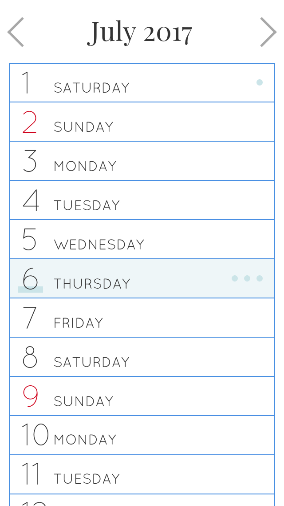
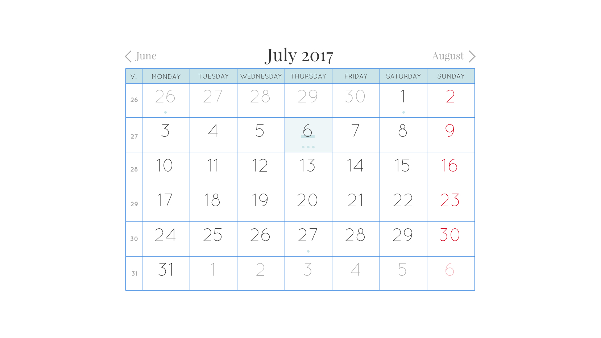
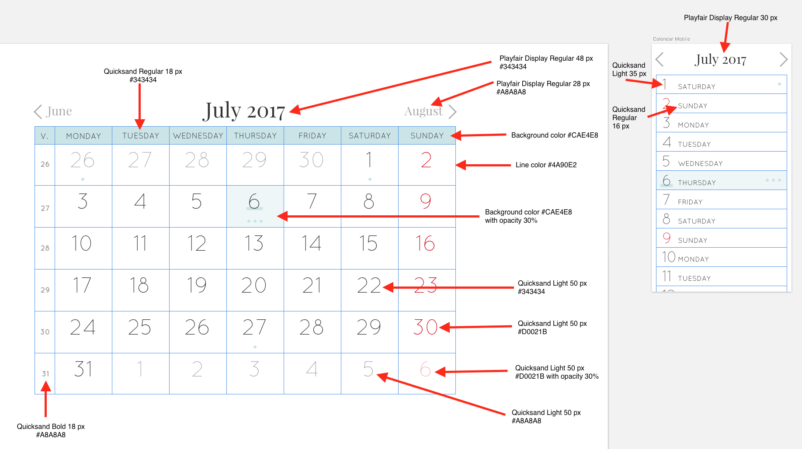

Photowall Front End Developer Challenge
=======================================
Create a reponsive calendar

Rules
-----
* You are only allowed to use the following languages: *HTML*, *CSS*, *JavaScript* (including Node.js)
* You can use any CSS and JS frameworks that you want (e.g bootstrap, React etc) but of course we prefer if most of the code is your own.

Step 1 - Create a responsive layout
-----------------------------------
On screensize <= 450px show mobile version

On screensize > 450px show desktop version

Use fonts and colors from the style guide

Step 2 - Add functionality
--------------------------
* Change month when you click the Next and Prev links
* On mobile it should be possible to change month by swiping left or right on the screen
* It should be possible to click on a day to list Events and to add a new Event. [This mock](event-mock.jpg) shows how it could work but please style it so it fits with the rest of the design.
* Add a field where you can enter the name of the Event and a button to save it (tip: you can use the browsers local storage for this)
* Events should be marked in the calendar as blue dots (see sketches)

Evaluation
----------
* The layout will be tested in all major browsers (not Internet Explorer) and on mobile phones (iPhone and Android)
* We will look how the code is structured, if its easy to understand and how well documented it is.
* We will look at how you test your code.

If you get stuck
----------------
If you find anything unclear in the description of the tasks, please choose one of the possible interpretations and comment on why you chose this interpretation.

Submission
----------
Please submit your solution via a zip file to martin@photowall.se
